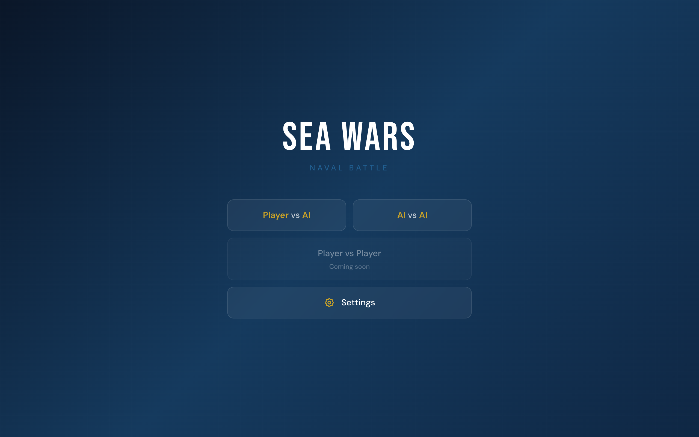
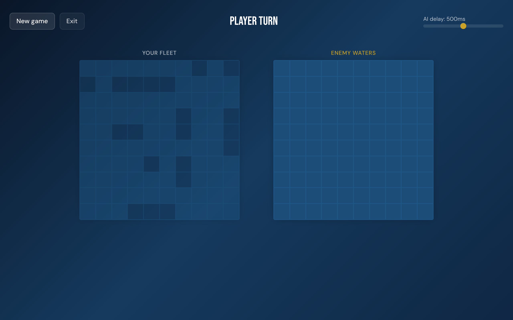
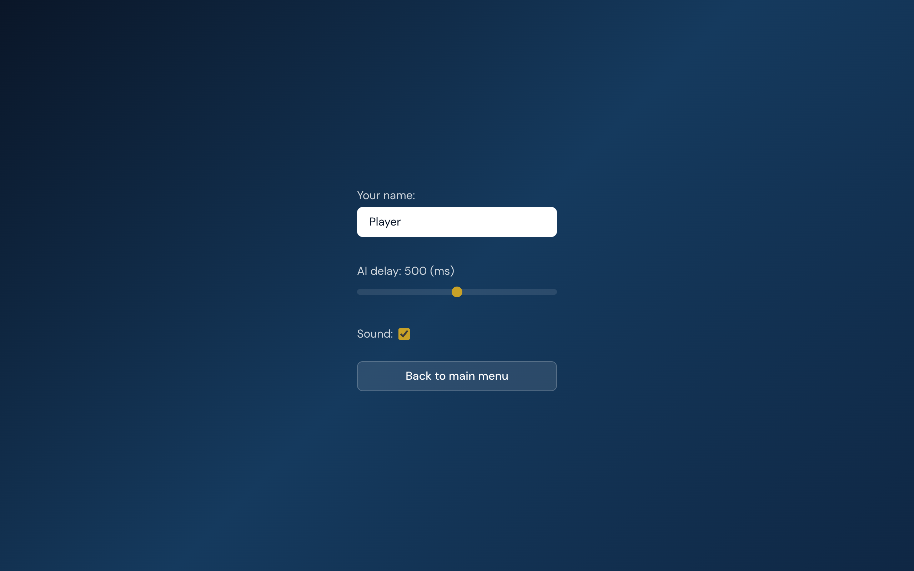

[](https://github.com/shubich/seawars/actions/workflows/ci.yml)
[](https://opensource.org/licenses/ISC)


# SeaWars

Классическая игра «Морской бой» в браузере на React + TypeScript.

Проект включает:
- современный UI (Tailwind + SCSS),
- несколько режимов игры,
- локальные звуки (без CORS-зависимостей),
- CI-пайплайн (lint + test + build).

## Возможности

- Режимы:
  - `Player vs AI`
  - `AI vs AI`
- Экран настроек:
  - имя игрока,
  - задержка AI,
  - включение/выключение звука.
- Звуковые эффекты выстрелов и победы/поражения (локальные `.ogg` в репозитории).
- Адаптивный интерфейс.

## Скриншоты

### Главное меню


### Игра


### Настройки


## Технологии

- React 16
- TypeScript
- Webpack 4
- Tailwind CSS 3
- Sass
- Jest
- ESLint

## Быстрый старт

### Требования

- Node.js (рекомендуется актуальный LTS)
- npm

### Установка

```bash
npm install
```

### Запуск в dev-режиме

```bash
npm start
```

После старта приложение доступно по адресу:
- `http://localhost:8080`

### Сборка production

```bash
npm run build
```

### Проверки качества

```bash
npm run lint
npm test
```

## Скрипты

- `npm start` — запуск dev-сервера webpack
- `npm run build` — production-сборка
- `npm run lint` — проверка ESLint
- `npm test` — тесты Jest + coverage

## Структура проекта

```text
src/
  actions/          # action creators
  components/       # переиспользуемые UI-компоненты
  constants/        # константы (включая sounds.ts)
  containers/       # контейнеры игровых режимов
  pages/            # страницы приложения (Main, Game, Settings)
  reducers/         # игровая логика reducer-ов
  styles/           # общие SCSS-модули
  utils/            # утилиты, AI, настройки
  assets/sound/     # локальные звуки .ogg
```

## Звуки

Звуки лежат локально в:
- `src/assets/sound/*.ogg`

На этапе сборки они копируются в:
- `dist/sound/*.ogg`

Это сделано специально, чтобы избежать проблем с CORS при загрузке аудио.

## Роутинг и базовый путь

Приложение использует `PUBLIC_PATH` как базовый путь (см. `src/constants/url.ts`).

Это удобно для GitHub Pages/подкаталогов:
- в CI выставлен `PUBLIC_PATH=/seawars/`.

## CI

Workflow: `.github/workflows/ci.yml`

Pipeline:
1. `npm ci`
2. `npm run lint`
3. `npm test -- --watchman=false`
4. `npm run build`
5. копирование `dist/index.html` в `dist/404.html` для SPA fallback

## Troubleshooting

### Ошибка `npm ci` про рассинхрон `package-lock.json`

Если CI падает с сообщением вида:
`npm ci can only install packages when your package.json and package-lock.json are in sync`

Сделайте:

```bash
npm install
```

Если нужно строго повторить окружение CI (npm 10), можно:

```bash
npx npm@10 install --package-lock-only
npx npm@10 ci
```

После этого закоммитьте обновлённый `package-lock.json`.
